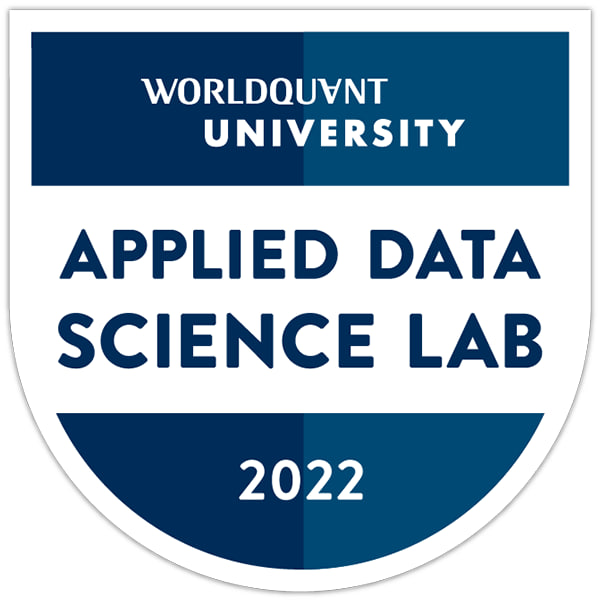
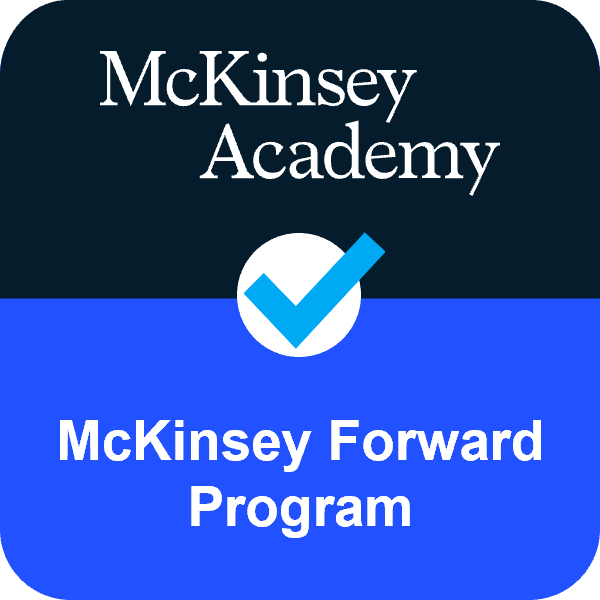
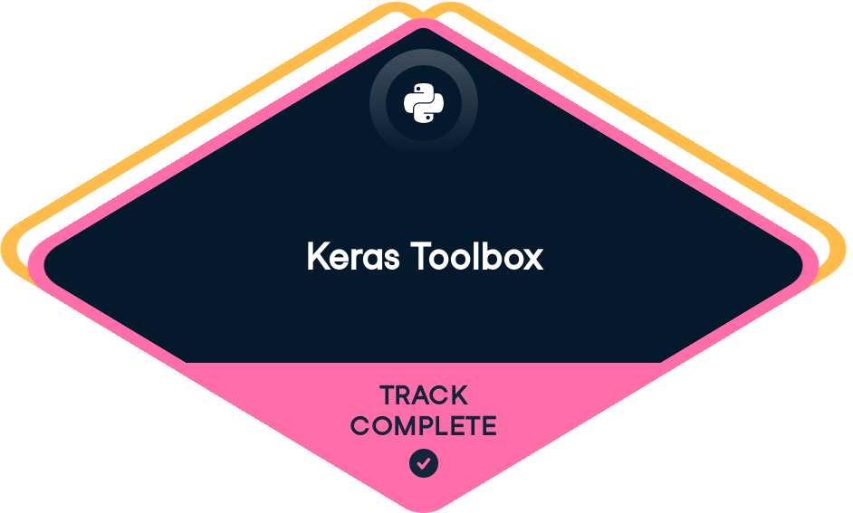
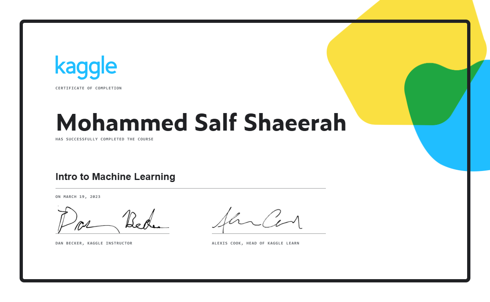
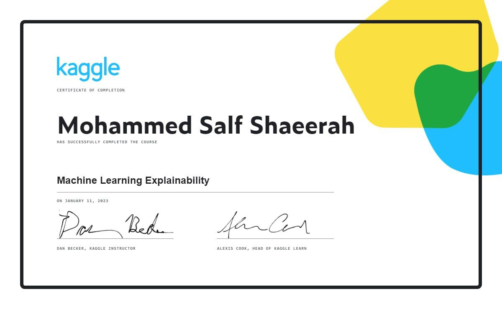

<a href="https://github.com/Mo-Sa-Shaeerah/Mo-Sa-Shaeerah"></a>

**`Machine Learning Engineer • GP Medical Doctor • Write Philosophy & Arab Poetry`**


## **`Me telling Me 👓`** 

- I am always telling myself that if I can **`understand 🗝️`**, I can be a **`scientist 🔓`** in any field that I am enthusiastic about.


## **`Imagination takes forms 🪐`**

- Imagination has various pathways, and among them is the `dark imagination 🕸️`, which can adversely affect the mental health of the mind that experiences it...


## **`My Skills 🤹🏽`**

1- Problem Solving 🩸:
<!--Problem-Solving-->
```mermaid
graph TD;
    Problem-Solving-->Diagnose;
    Problem-Solving-->Define;
    Problem-Solving-->Reframe;
    Problem-Solving-->Break-it-In-Steps;
    Problem-Solving-->Vision;
    Problem-Solving-->Solve;
   ```

2- Data Analysis 🧬:
  <!--Data-Analysis-->
```mermaid
graph TD;
    Data-Analysis-->Python;
    Data-Analysis-->Statistics;
    Data-Analysis-->Extract-Insights;
    Data-Analysis-->EDA;
    Data-Analysis-->Decision-Maker;
    Data-Analysis-->Critical-Thinking;
   ```
  

3- Machine learning 💉:
  <!--Machine-Learning-->
```mermaid
graph TD;
    Machine-Learning-->Data;
    Machine-Learning-->Algorithms;
    Machine-Learning-->Statistical-Models;
    Machine-Learning-->Feature-Engineering;
    Machine-Learning-->Evaluation-Metrics;
    Machine-Learning-->Deployment;
   ```
   

4- Deep Learning 🩺:
<!--Deep-Learning-->
```mermaid
graph TD;
    Deep-Learning-->Data;
    Deep-Learning-->Neural-Networks;
    Deep-Learning-->Computer-Vision;
    Deep-Learning-->Tensorflow-Keras;
    Deep-Learning-->CNN-RNN-LSTM;
    Deep-Learning-->Medical-Uses;
   ```

5- Medical-Mindset 🌡️🧪:
<!--Medical-Mindset-->
```mermaid
graph TD;
    Medical-Mindset-->Brain;
    Medical-Mindset-->Neuronal-Cells;
    Medical-Mindset-->Input-Processing-Output;
    Medical-Mindset-->Diagnosis-Treatment-Prognosis;
    Medical-Mindset-->Investigate-Every-Sign;
    Medical-Mindset-->Keep-on-Learning;
   ```

## **`Releted To Me 🪔`**
👩‍💻 I am currently working as a data scientist intern with ShAI.

🧠 I am continuously expanding my knowledge in data science, AI, and medicine 🩺💉.

👯‍♀️ I am open to collaborations with fellow data scientists.

⚡️ Fun fact: Writing poetry is worth staying up late for.
<br>


## **`Connect With Me 📞`**

[](https://linkedin.com/in/mo-sa-shaeerah)
[](https://medium.com/@Mo_Sa_Shaeerah/)
[](https://threads.net/mo___.Shaeerah)
[](https://www.instagram.com/mo_sa_shaeerah/)
[](https://www.kaggle.com/mohammedsalf)
[](https://www.youtube.com/channel/UCE4Ksc_7mqSqBmTWm-TeWfA)
<br/>
<br/>


## **`My Badges & Certificates 🍂`**

<a href="https://www.credly.com/badges/d5f3edd0-5635-4032-a75d-8da862a7134c/linked_in_profile"></a>
<a href="https://www.credly.com/badges/2684c8f4-f801-4b29-89ff-59e6c2ccad28/public_url"></a>
<a href="https://www.datacamp.com/completed/statement-of-accomplishment/track/d3f5d1a3545c3fa8c49e96dbddc9380a3049b862"></a>
<a href="https://almdrasa.com/certificate-verification/1454BFDB5-1453C6C2C-127129078/"></a>
<a href="https://www.kaggle.com/learn/certification/mohammedsalf/intro-to-machine-learning"></a>
<a href="https://www.kaggle.com/learn/certification/mohammedaieng/intermediate-machine-learning"></a>
<a href="https://www.kaggle.com/learn/certification/mohammedaieng/machine-learning-explainability"></a>
<br/>
<br/>


## **`My Status In A Graph 🎢`**
  
<p align=center>
  <div align=center>
    <a href="https://github.com/denvercoder1/github-readme-streak-stats" title="Mohammed Salf Shaeerah">
      
    </a>
    <a href="https://github.com/anuraghazra/github-readme-stats" title="Mohammed Salf Shaeerah">
      
    </a>
  </div>
  <br><br><br><br><br><br><br><br><br>
  </div>
  
  
